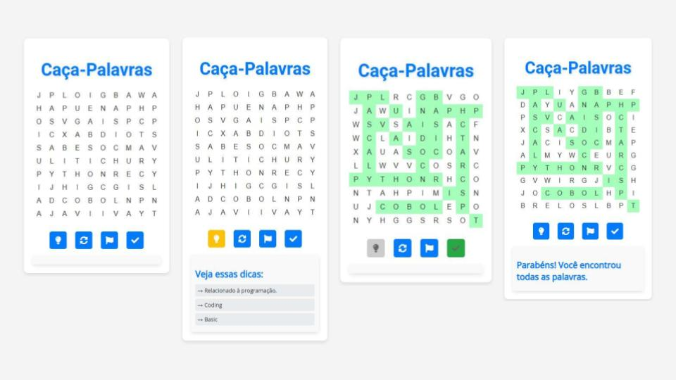

# Caça-Palavras

<p>Este é um jogo de caça-palavras desenvolvido em HTML, CSS e JavaScript, com aplicação de AJAX, para a disciplina de Construção de Páginas Web 2<br>
  Prof. Lucian José Gonçales<br>
  Curso: Sistemas para Internet - IFRS/POA</p>

### Tecnologias Utilizadas

- **HTML**: Estrutura do jogo.
- **CSS**: Estilização do jogo.
- **JavaScript**: Lógica do jogo, manipulação do DOM e interatividade.

## Comportamento do Jogo

O jogo consiste em um tabuleiro de 10x10 letras onde palavras estão escondidas de forma horizontal, vertical ou diagonal. O objetivo do jogador é encontrar e marcar todas as palavras na grade. O jogador pode clicar em uma letra para marcar sua seleção; se clicar novamente, a seleção é desfeita. Ao clicar em "Verificar", o jogo validará se todas as palavras foram encontradas corretamente.

### Funcionalidades

- **Botão Reiniciar**: Recarrega o tabuleiro com uma nova grade de letras e palavras.
- **Botão Verificar**: Verifica se as palavras foram encontradas corretamente e, se sim, exibe uma mensagem de parabéns.
- **Botão Desistir**: Revela todas as palavras escondidas na grade.
- **Botão Pistas**: Mostra dicas para ajudar a encontrar as palavras.

### Visão Geral da Aplicação


## Instruções para Baixar o Jogo

1. Clone este repositório em seu ambiente local.
   ```sh
   git clone https://github.com/seu-usuario/seu-repositorio.git

2. Abra o arquivo index.html em seu navegador para executar a aplicação.

### Para jogar, acesse a demonstração aqui:
[Abrir jogo Caça-Palavras](https://cpwcp.vercel.app/)
 


